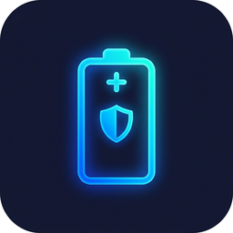

<p align="center">
  
</p>

<h1 align="center">Battery Daemon</h1>

<p align="center">
  <strong>A lightweight, cross-platform background battery monitor built in Rust that enforces the 80/20 battery health rule via native system notifications and tray controls.</strong>
</p>

<p align="center">
  <a href="https://github.com/Adwaith-Balakrishnan/battery-daemon/releases/latest"></a>
  <a href="LICENSE"></a>
  
  <a href="https://github.com/Adwaith-Balakrishnan/battery-daemon/actions"></a>
</p>

---

## Why Battery Daemon?

Lithium-ion batteries degrade fastest when held at **full charge (100%)** or drained to **empty (0%)**. Research consistently shows that keeping your battery between **20% and 80%** significantly extends its lifespan — often by **2–4×** compared to full charge cycles.

**Battery Daemon** monitors your charge level in the background and sends you a native OS notification the moment you cross either threshold:

- ⚡ **≥ 80% while charging** → _"Unplug your charger to protect battery health."_
- 🪫 **≤ 20% while discharging** → _"Plug in your charger to prevent shutdown."_

### Why not an Electron app or a GUI tool?

|                      | Battery Daemon        | Typical GUI Monitor          |
| -------------------- | --------------------- | ---------------------------- |
| **Binary size**      | ~3 MB standalone      | 50–200 MB (Electron runtime) |
| **Memory footprint** | < 5 MB RSS            | 80–300 MB                    |
| **CPU wake cycles**  | Once every 60 seconds | Continuous rendering         |
| **Console window**   | None (headless)       | Often spawns terminal        |
| **Telemetry**        | Zero — fully offline  | Varies                       |

Battery Daemon is a single native binary with no runtime dependencies, no background telemetry, and no visible window. It sits in your system tray and does one thing well.

---

## Features

- 🔋 **System Tray Integration** — Runs silently in your taskbar (Windows), menu bar (macOS), or system tray (Linux). Right-click for controls.
- 🔔 **Native OS Notifications** — Uses Win32 Toast (Windows), `osascript` (macOS), and `notify-send` (Linux). No custom notification UI.
- 🧠 **Hysteresis State Machine** — Fires a notification once per threshold crossing, then enters a cooldown band (resets at 75%/25%) to prevent spam when hovering near 80% or 20%.
- 🚀 **Auto-Launch on Startup** — Registers itself to start with your OS via the `auto-launch` crate. No manual shortcut setup needed.
- 🛡️ **Fully Offline & Private** — Standalone binary. No network calls, no analytics, no cloud dependencies.
- 🖥️ **True Headless Operation** — No console window on Windows (`#![windows_subsystem = "windows"]`). Pure background daemon.

---

## Installation

Download the latest pre-compiled package from [**GitHub Releases**](https://github.com/Adwaith-Balakrishnan/battery-daemon/releases/latest).

### Windows

Download `battery-daemon_<version>_x64-setup.exe` and run it.

<details>
<summary>⚠️ Windows SmartScreen Warning</summary>

Since the binary is open-source and self-signed (not code-signed with a commercial certificate), Windows SmartScreen may block it:

1. Click **"More info"** on the SmartScreen popup.
2. Click **"Run anyway"**.

This is expected for any unsigned open-source application.

</details>

### macOS

Download the `.dmg` file, open it, and drag **Battery Daemon** to your Applications folder.

<details>
<summary>⚠️ Apple Gatekeeper Warning</summary>

macOS may block the app from an unidentified developer:

1. Open **System Settings → Privacy & Security**.
2. Scroll down and click **"Open Anyway"** next to the Battery Daemon message.

</details>

### Linux

| Format            | Command                                                             |
| ----------------- | ------------------------------------------------------------------- |
| **AppImage**      | `chmod +x battery-daemon_*.AppImage && ./battery-daemon_*.AppImage` |
| **Debian/Ubuntu** | `sudo dpkg -i battery-daemon_*_amd64.deb`                           |

> **Note:** Linux requires `libnotify` (for `notify-send`) and a desktop environment with system tray support.

---

## Usage & Controls

Once launched, Battery Daemon places an icon in your system tray. **Right-click** the tray icon to access:

| Menu Item          | Action                                              |
| ------------------ | --------------------------------------------------- |
| **Pause Monitor**  | Temporarily stops battery polling and notifications |
| **Resume Monitor** | Resumes monitoring after a pause                    |
| **Quit**           | Cleanly shuts down the daemon                       |

The daemon polls your battery every **60 seconds** and uses a state machine with hysteresis to avoid notification spam:

```
          ┌─────────────────────────────────┐
          │           Safe State            │
          │    (No notifications active)    │
          └──────┬──────────────┬───────────┘
                 │              │
        ≥80% &  │              │  ≤20% &
       charging │              │ discharging
                 ▼              ▼
     ┌──────────────┐  ┌──────────────┐
     │ WarnedHigh   │  │  WarnedLow   │
     │  (notified)  │  │  (notified)  │
     └──────┬───────┘  └──────┬───────┘
            │                 │
    <75% or │                 │ >25% or
   unplugged│                 │ plugged in
            ▼                 ▼
          ┌─────────────────────────────────┐
          │         Back to Safe            │
          └─────────────────────────────────┘
```

---

## Architecture & Engineering Overview

Battery Daemon is built on a **dual-thread architecture** with clean separation of concerns:

```
┌─────────────────────────────────────────────────────────┐
│  Main Thread                                            │
│  ┌───────────────────────────────────────────────────┐  │
│  │ OS-native event loop                              │  │
│  │  • Win32 Message Pump (Windows)                   │  │
│  │  • 100ms polling loop (macOS / Linux)             │  │
│  │  • Processes tray menu clicks → sends commands    │  │
│  └───────────────────┬───────────────────────────────┘  │
│                      │ mpsc::channel<DaemonCommand>     │
│                      ▼                                  │
│  ┌───────────────────────────────────────────────────┐  │
│  │ Background Thread (daemon::poller)                │  │
│  │  • recv_timeout(60s) — efficient blocking         │  │
│  │  • Queries BatteryProvider on each timeout        │  │
│  │  • Feeds status into BatteryStateMachine          │  │
│  │  • Fires native notification if state transitions │  │
│  └───────────────────────────────────────────────────┘  │
└─────────────────────────────────────────────────────────┘
```

### Key Crates

| Crate                                                 | Purpose                                                                 |
| ----------------------------------------------------- | ----------------------------------------------------------------------- |
| [`tray-icon`](https://crates.io/crates/tray-icon)     | Cross-platform system tray icon management                              |
| [`muda`](https://crates.io/crates/muda)               | Cross-platform native context menus                                     |
| [`auto-launch`](https://crates.io/crates/auto-launch) | OS-level startup registration                                           |
| [`windows`](https://crates.io/crates/windows)         | Win32 API bindings (battery queries, toast notifications, message pump) |

### Platform-Specific Providers

The `BatteryProvider` trait abstracts OS-specific battery queries and notifications behind a unified interface. At compile time, `cfg(target_os)` selects the active provider:

| Platform    | Battery Query                                      | Notifications                                  |
| ----------- | -------------------------------------------------- | ---------------------------------------------- |
| **Windows** | `PowerManager::RemainingChargePercent()` via WinRT | Win32 Toast XML via `ToastNotificationManager` |
| **macOS**   | `pmset -g batt` subprocess                         | `osascript display notification`               |
| **Linux**   | `/sys/class/power_supply/BAT0/capacity` sysfs      | `notify-send` (libnotify)                      |

---

## Building from Source

### Prerequisites

| Requirement        | Details                                                                     |
| ------------------ | --------------------------------------------------------------------------- |
| **Rust toolchain** | Install via [rustup.rs](https://rustup.rs) (stable channel)                 |
| **Windows**        | MSVC C++ build tools (via Visual Studio Build Tools)                        |
| **macOS**          | Xcode Command Line Tools (`xcode-select --install`)                         |
| **Linux**          | `sudo apt-get install libgtk-3-dev libayatana-appindicator3-dev libxdo-dev` |

### Build & Run

```bash
# Clone the repository
git clone https://github.com/Adwaith-Balakrishnan/battery-daemon.git
cd battery-daemon

# Run in debug mode
cargo run

# Build optimized release binary
cargo build --release
# Binary output: target/release/battery-daemon[.exe]
```

<details>
<summary>📦 Building distributable packages</summary>

To create platform-specific installers (`.msi`, `.dmg`, `.deb`, `.AppImage`):

```bash
# Install the packager
cargo install cargo-packager --locked

# Build and package
cargo build --release
cargo packager --release
```

Output will be in `target/release/`.

</details>

---

## Contributing

Contributions are welcome! Here's how to get started:

1. **Open an issue** to discuss the feature or bug before starting work.
2. **Fork the repo** and create a feature branch (`git checkout -b feat/my-feature`).
3. **Submit a pull request** with a clear description of your changes.

Please keep PRs focused — one feature or fix per PR.

---

## License

This project is open source. See the [LICENSE](LICENSE) file for details.

---

<p align="center">
  <sub>Built with 🦀 Rust — by <a href="https://github.com/Adwaith-Balakrishnan">Adwaith Balakrishnan</a></sub>
</p>
